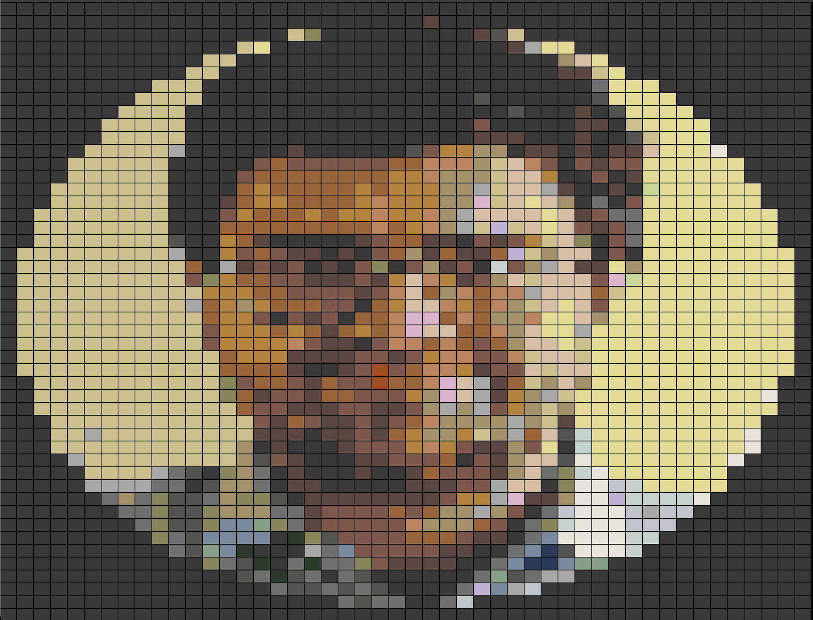

# Lego Mosaic Piece Generator
A rust app that generates grids of pixels for lego mosaics.

## Example
```
cargo build
./target/debug/BlockMosaicCreator media/me.png sample/colors.json
```

### Before


### After
